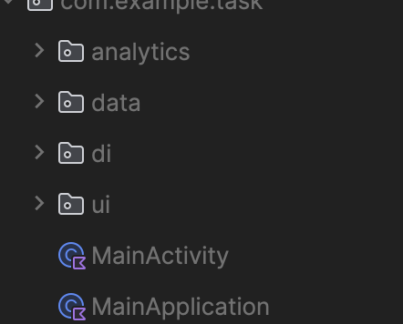
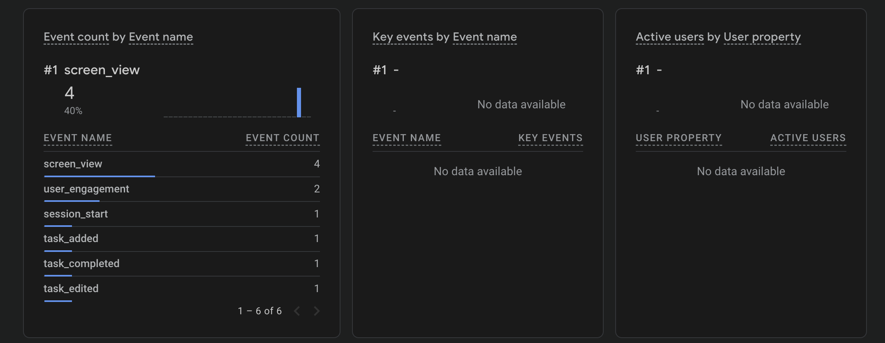
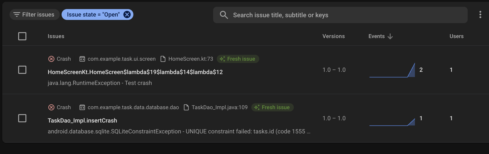
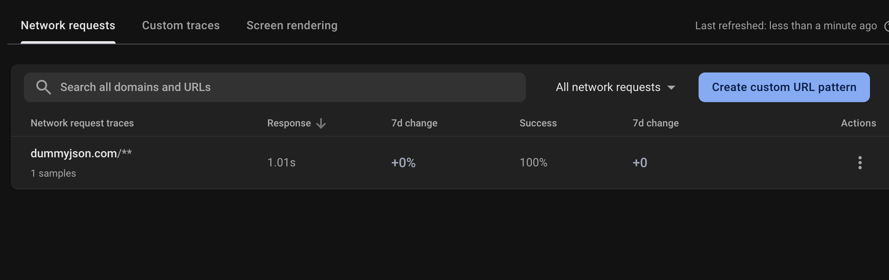

# Task - An app for managing all your tasks.

### External libraries used
This app has support for:
1) Firebase Analytics
2) Firebase Performance Monitoring
3) Firebase crashlytics

To start making use of this, just replace `google-services.json` file with the one for your firebase project ([Create a new firebase project](https://firebase.google.com/docs/android/setup)).

### Application Design

App is designed using the [Layered Architecture](https://developer.android.com/topic/architecture/recommendations#layered-architecture) as the scope of the app is limited to few use-cases.
There are mainly two layers (UI and Data)

Within the Data Layer, there is support for both network and local data. And all data has been made available through a Repository (TaskRepository here).

## Sample Reports

1) Analytics Events

2) App Crash

[Crash Recording](assets/crash.mov)

[Database Crash Recording](assets/database_crash.mov)

3) Network Performance
